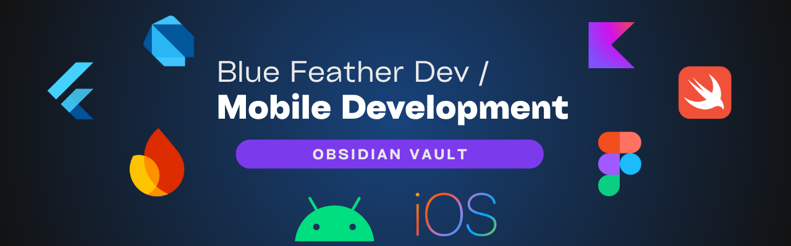

# Hello, Mobile Development!

Un espacio personal de aprendizaje y exploración sobre **desarrollo móvil** Android y iOS.

> Este repositorio está en constante evolución. Las notas están en construcción.

## ⚙️ Cómo funciona

Este repositorio funciona como un **vault de Obsidian**, donde organizo mis notas, ideas y recursos sobre temas como:

- Flutter & Dart
  
- Android & iOS
- Desarrollo Nativo vs Multiplataforma
- UI/UX para móviles
- Roadmaps, tipos de apps y más...

## 📁 Estructura del repositorio

Las notas están organizadas en carpetas temáticas para facilitar su exploración:

| Carpeta       | Contenido                                                              |
|--------------|-------------------------------------------------------------------------|
| [`overview/`](./overview)    | Introducciones generales, notas de visión, objetivos y contexto.       |
| [`languages/`](./languages)   | Conceptos y prácticas sobre lenguajes como Dart, Kotlin o Swift.       |
| [`frameworks/`](./frameworks)  | Frameworks móviles como Flutter, React Native y otros.                 |
| [`backend/`](./backend)     | Notas sobre bases de datos, APIs, autenticación y servicios backend.   |
| [`os/`](./os)          | Sistemas operativos móviles, ciclo de vida, arquitectura, etc.         |
| [`database/`](./database)    | Tipos de bases de datos, consultas y herramientas como Firebase, etc.  |
| [`roadmaps/`](./roadmaps)    | Mapas de ruta de aprendizaje, guías y caminos sugeridos.               |
| [`setup/`](./setup)       | Configuración de entorno, instalación de herramientas, etc.            |
| [`tools/`](./tools)       | Utilidades, extensiones, paquetes y recursos útiles.                   |
| [`ui-ux/`](./ui-ux)       | Principios de diseño, patrones UI, usabilidad y accesibilidad.         |

Cada carpeta contiene archivos Markdown (`.md`) con notas conectadas a través de enlaces internos.

## 🎯 Objetivos del repositorio

- Construir un segundo cerebro técnico  sobre le desarrollo móvil
  
- Elaborar un mapa útil para una visión clara del área de estudio
- Definir términos y palabras claves del vocabulario de desarrollo de apps

> Hello World! '\u{2665}'
